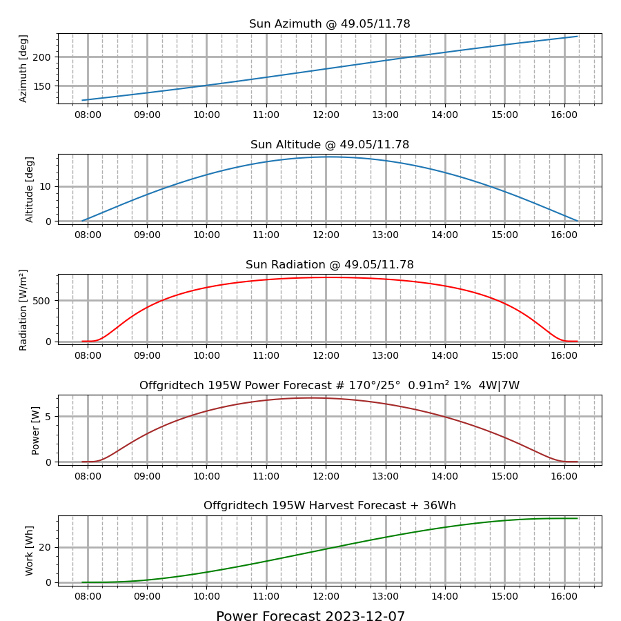

Estimate the power of solar panels for a given day dependent on various factors

'panel_estimate.py' is the only script provided. It is dependent on 'pysolar', 'pandas' and 'matplotlib' to be installed somehow.

```
~/solar_panel $ ./panel_estimate.py -h
usage: panel_estimate.py [-h] [--version] [--lat LAT] [--lon LON] [--panel_name PANEL_NAME]
                         [--panel_direction PANEL_DIRECTION] [--panel_slope PANEL_SLOPE] [--panel_area PANEL_AREA]
                         [--panel_efficiency PANEL_EFFICIENCY] [--threshold THRESHOLD] [--battery_split BATTERY_SPLIT]
                         [--battery_full BATTERY_FULL] [--battery_swap BATTERY_SWAP] [--plot PLOT] [--csv CSV]
                         [forecast_day]

Estimates the power of a solar panel

positional arguments:
  forecast_day          Day for forecast

options:
  -h, --help            show this help message and exit
  --version             show program's version number and exit
  --lat LAT             Latitude of the panel position
  --lon LON             Longitude of the panel position
  --panel_name PANEL_NAME
                        Name of the panel
  --panel_direction PANEL_DIRECTION
                        Direction of the panel normale relative to north [0 - 360]
  --panel_slope PANEL_SLOPE
                        Slope of the panel normale relative to surface [0 - 360]
  --panel_area PANEL_AREA
                        Size of the panel area [m²]
  --panel_efficiency PANEL_EFFICIENCY
                        Nominal efficiency of the panel [%]. Can be reduced for degradations like scattered sky etc
  --threshold THRESHOLD
                        Threshold when system accepts input power [W]
  --battery_split BATTERY_SPLIT
                        Threshold when to charge battery in systems with storage [W]
  --battery_full BATTERY_FULL
                        Energy when a battery is considered full in systems with storage [Wh]
  --battery_swap BATTERY_SWAP
                        If False the user power is limited to the provided value. The battery consumes the rest. If False the
                        user power is limited to the provided value. The battery uses the rest.
  --plot PLOT           Directory for saving of the plots if needeed
  --csv CSV             Directory for saving of the CSV file if needed
~/solar_panel $

```

Under scripts there are a few examples. To run define PANEL_ESTIMATE_STORE_DIR first.

```
~/solar_panel/scripts $ . offgridtech_195W_victron.sh
INFO:panel_estimate.py:Estimating the harvest of "Offgridtech 195W" on "2023-12-07"
INFO:panel_estimate.py: Lat/Lon:"49.05/11.78", Dir/Slope:"170/25"
INFO:panel_estimate.py: Area: "0.91m²", Efficiency: "1%", Threshold: "0W"
INFO:panel_estimate.py:Sun Rise:"07:55 CET", Set:"16:13 CET"
INFO:panel_estimate.py: Mean:"543W/m²", Max:"777W/m²", Total:"270988Wh/m²"
INFO:panel_estimate.py: Azimuth/Altitude (Max): "180/18" @ "12:04 CET"
INFO:panel_estimate.py:Harvest Start:"07:55 CET", End:"16:13 CET"
INFO:panel_estimate.py: Mean:"4W", Max:"7W", Total:"36Wh", "3Ah"
INFO:panel_estimate.py:Plot saved to  "/data/data/com.termux/files/home/storage/panel_estimate/plot/Offgridtech_195W_2023-12-07.png"
INFO:panel_estimate.py:CSV saved to  "/data/data/com.termux/files/home/storage/panel_estimate/csv/Offgridtech_195W_2023-12-07.csv"
~/solar_panel/scripts $
~/solar_panel/scripts $ feh  "/data/data/com.termux/files/home/storage/panel_estimate/plot/Offgridtech_195W_2023-12-07.png"
~/solar_panel/scripts $
```

