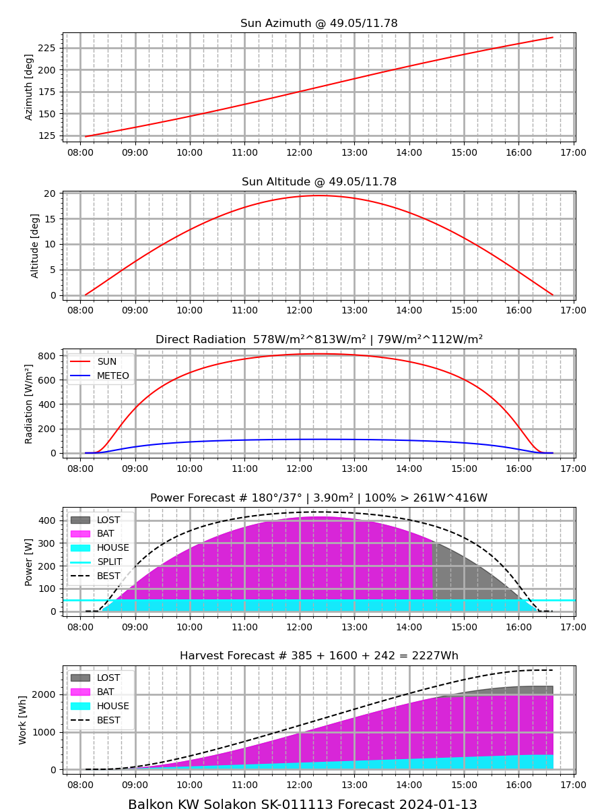

Estimate the power of solar panels for a given day dependent on various factors

'solar_prophet.py' is the only script provided. It is dependent on 'pysolar', 'pandas' and 'matplotlib' to be installed somehow.

```
~/solar_prophet $ ./solar_prophet.py -h
usage: solar_prophet.py [-h] [--version] [--lat LAT] [--lon LON] [--panel_name PANEL_NAME] [--panel_direction PANEL_DIRECTION] [--panel_slope PANEL_SLOPE]
                        [--panel_area PANEL_AREA] [--panel_efficiency PANEL_EFFICIENCY] [--start_barrier START_BARRIER] [--inverter_limit INVERTER_LIMIT]
                        [--battery_split BATTERY_SPLIT] [--battery_full BATTERY_FULL] [--battery_first] [--csv CSV] [--plot]
                        [forecast_day]

Estimates the power and energy of a solar panel

positional arguments:
  forecast_day          Day for forecast

options:
  -h, --help            show this help message and exit
  --version             show program's version number and exit
  --lat LAT             The latitude of the panel position [0 - 360]
  --lon LON             The longitude of the panel position [0 - 360]
  --panel_name PANEL_NAME
                        The name of the panel
  --panel_direction PANEL_DIRECTION
                        The direction of the panel normale relative to north [0 - 360]
  --panel_slope PANEL_SLOPE
                        The slope of the panel normale relative to surface [0 - 360]
  --panel_area PANEL_AREA
                        The size of the panel area [m²]
  --panel_efficiency PANEL_EFFICIENCY
                        The efficiency of the panel [%]. Blue Sky ~ 180. Mist ~ 20
  --start_barrier START_BARRIER
                        The threshold when the system accepts the input [W]
  --inverter_limit INVERTER_LIMIT
                        The maximum power limit of the inverter [W]
  --battery_split BATTERY_SPLIT
                        The threshold when to charge the battery in systems with storage [W]
  --battery_full BATTERY_FULL
                        The energy when a battery is considered full in systems with storage [Wh]
  --battery_first       Serve the battery first! Serve the house second!
  --csv CSV             The directory for saving of the CSV file if needed
  --plot                Display the results in a plot

Estimates the power of a solar panel dependent on different factors like location and pannel attitude
~/solar_prophet $

```

Under scripts there are a few examples. To run define the SOLAR_PROPHET_STORE_DIR first.

```
~/solar_prophet $ cd scripts/
~/solar_prophet/scripts $ . balkonkraftwerk_solix.sh
INFO:solar_prophet.py:Estimating the harvest of "Balkon KW Solakon SK-011113" on "2024-01-13"
INFO:solar_prophet.py: Area: "3.90m²", Lat/Lon:"49.05/11.78", Dir/Slope:"180/37"
INFO:solar_prophet.py: Efficiency: "100%", Start Barrier: "10W", Inverter Limit: "600W"
INFO:solar_prophet.py:Best Radiation Attitude # "180/19" @ "12:21 CET"
INFO:solar_prophet.py:Sun # Rise:"08:06 CET", Set:"16:37 CET", "8.5h"
INFO:solar_prophet.py:Sun # Mean:"578W/m²", Max:"813W/m²", Total:"4932Wh/m²"
INFO:solar_prophet.py:Meteo # Mean:"79W/m²", Max:"112W/m²", Total:"677Wh/m²"
INFO:solar_prophet.py:Harvest # Rise: "08:25 CET", Set:"16:18 CET", "7.9h"
INFO:solar_prophet.py:Harvest # Mean:"261W", Max:"416W", Total:"2227Wh", "178Ah"
~/solar_prophet/scripts $
```


